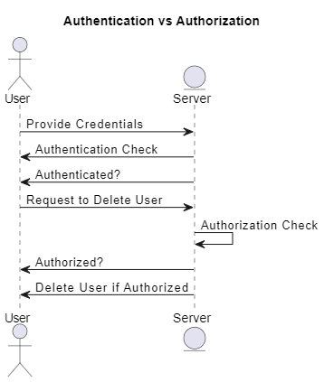

### Step 2: Challenge Part 2

In the second challenge, you are required to explain whether the statement "This delete user functionality can be done after authentication" is a good idea or a bad idea based on your knowledge of authentication and authorization. 

#### Explanation:

**Authentication** and **Authorization** are two fundamental concepts in web security that serve different purposes:

- **Authentication** is the process of verifying the identity of a user. It confirms that the user is who they claim to be. Typically, this involves checking credentials like a username and password.
  
- **Authorization** is the process of determining what an authenticated user is allowed to do. This ensures that the user has the right permissions to perform certain actions, such as deleting another user's account.

**Why this requirement is a bad idea:**

The requirement "This delete user functionality can be done after authentication" suggests that any authenticated user can delete another user's account. While authentication is necessary to verify the user's identity, it is not sufficient on its own to authorize sensitive actions like deleting a user account. 

Allowing all authenticated users to delete accounts without proper authorization could lead to serious security risks. For example, a regular user could delete other users’ accounts, causing havoc and potentially compromising the entire system.

**Why Authentication and Authorization are Different:**

- **Authentication** answers the question: "Who are you?"
- **Authorization** answers the question: "What are you allowed to do?"

Even after a user is authenticated, the system must check if they are authorized to perform the specific action they are requesting. Without proper authorization checks, the system might allow actions that could lead to unauthorized data access, data loss, or other malicious activities.

#### Conclusion:

While authentication is crucial, it is equally important to implement proper authorization checks before allowing sensitive actions such as deleting user accounts. A better approach would be to ensure that only users with specific roles (like admins) are authorized to delete accounts, not just any authenticated user.

#### Diagram:

Here is a simple diagram illustrating the difference between authentication and authorization in this context:

### Step 1: Implementing the Delete User Functionality

**File Name:** `deleteUserFunctionality.js`

#### Summary:

In this step, we integrated a feature allowing authenticated users to delete a user account based on the provided username. This functionality is implemented both on the backend and the frontend.

1. **Backend Controller (authController.js):**
   - **delete_user_by_username:** This function is responsible for deleting a user from the database based on the username provided in the request. It uses Sequelize's `destroy` method to remove the user entry.

2. **Backend Routes (authHandling.js):**
   - A new route `/delete/user` was created. This route requires the user to be authenticated before proceeding to delete the specified user. The route is linked to the `delete_user_by_username` function in the controller.

3. **Frontend Interaction (userProfile.js or separate JS file):**
   - A form submission handler was added to prompt the user to enter the username they wish to delete. This handler sends a POST request to the backend with the provided username.

4. **Frontend Form Handling:**
   - A simple form is added on the frontend where users can enter a username and submit a request to delete that user.

This functionality demonstrates a full-stack implementation of a user deletion feature, involving both frontend interaction and backend processing.

